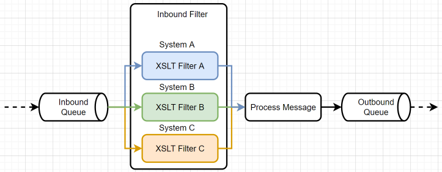

# Introduction
I want to share an elegant technique for filtering XML messages in this article.

I will demonstrate how to create a future-proof solution to handle structural changes in XML messages.

This technique helps deal with XML messages where message structure might change over time.

Target audience: developers, software engineers, and architects.

# Background
Back in the day,
I was tasked to come up with a solution to filter XML messages coming from Oracle Human Capital Management
(HCM).
The incoming messages were in XML format.
In HCM terminology, they are called HCM extracts.

The HCM extracts were processed by middleware (webMethods Integration Platform) and sent to various downstream systems.
We have here one-to-many integration where one source system feeds multiple downstream systems.

Terms message, XML message, HCM message,
and HCM extract are used interchangeably in this article and represent information in XML format.


# Main Requirement
The main requirement is that each downstream system must receive only an exact subset of XML elements it needs and nothing else.

# Let's Get Technical

Let's say you have a simple message like this:

```xml
<?xml version="1.0" encoding="UTF-8"?>
<ns0:Employee xmlns:ns0="https://www.example.com/employee">
    <ns0:Name>John</ns0:Name>
    <ns0:Age>30</ns0:Age>
    <ns0:Address>
        <ns0:Street>123 Main Street</ns0:Street>
        <ns0:City>San Francisco</ns0:City>
        <ns0:State>CA</ns0:State>
        <ns0:Zip>94105</ns0:Zip>
    </ns0:Address>
    <ns0:Phone>
        <ns0:Home>111-111-1111</ns0:Home>
        <ns0:Mobile>222-222-2222</ns0:Mobile>
    </ns0:Phone>
    </ns0:Employee>
```

For a downstream `System A` you want to keep only `<ns0:Name>` and `<ns0:Zip>` elements. The result should look like this:

```xml
<?xml version="1.0" encoding="UTF-8"?>
<ns0:Employee xmlns:ns0="https://www.example.com/employee">
    <ns0:Name>John</ns0:Name>
    <ns0:Address>
        <ns0:Zip>94105</ns0:Zip>
    </ns0:Address>
    </ns0:Employee>
```

`System B` requires only `<ns0:Name>` and `<ns0:Mobile>` elements. The result should look like this:

```xml
<?xml version="1.0" encoding="UTF-8"?>
<ns0:Employee xmlns:ns0="https://www.example.com/employee">
    <ns0:Name>John</ns0:Name>
    <ns0:Phone>
      <ns0:Mobile>222-222-2222</ns0:Mobile>
    </ns0:Phone>
    </ns0:Employee>
```

At first sight, this is straightforward.
You store somewhere a list of XML elements you want to keep for each downstream system.
You traverse incoming XML messages and remove the XML elements not present in the list.

This is a perfectly valid approach. Doable in any programming language. But this approach has a few drawbacks. The main one is that you must write the code, test it and debug it. And this will be, for sure, an error-prone and time-consuming process.

# The Catch
The catch is that the set of XML elements in HCM extracts can change over time.
HCM extracts define which employee attributes are extracted from Oracle HCM.
Simply put, an HCM extract is a structured list of employee attributes used to extract data from Oracle HCM.
Something like a report where you can define which employee attributes you want to extract from HCM.

Developers of HCM extracts can add new XML elements, or they can add brand-new levels to the extract definition.

On the one hand, you have to process inbound messages without control over the structure.
On the other hand, you have downstream systems that require messages precisely in the structure they expect.

Let's say that the extract definition has changed and `<ns0:Surname>` and `<ns0:Email>` were added.
Sample message:
```xml
<?xml version="1.0" encoding="UTF-8"?>
<ns0:Employee xmlns:ns0="https://www.example.com/employee">
  <ns0:Name>John</ns0:Name>
  <ns0:Surname>Doe</ns0:Surname>
  <ns0:Age>30</ns0:Age>
  <ns0:Address>
    <ns0:Street>123 Main Street</ns0:Street>
    <ns0:City>San Francisco</ns0:City>
    <ns0:State>CA</ns0:State>
    <ns0:Zip>94105</ns0:Zip>
  </ns0:Address>
  <ns0:Email>
    <ns0:Work>john.doe@acme.com</ns0:Work>
    <ns0:Personal>john.doe@yahoo.com</ns0:Personal>
  </ns0:Email>
  <ns0:Phone>
    <ns0:Home>111-111-1111</ns0:Home>
    <ns0:Mobile>222-222-2222</ns0:Mobile>
  </ns0:Phone>
</ns0:Employee>
```

System `A` must still receive this message:
```xml
<?xml version="1.0" encoding="UTF-8"?>
<ns0:Employee xmlns:ns0="https://www.example.com/employee">
    <ns0:Name>John</ns0:Name>
    <ns0:Address>
        <ns0:Zip>94105</ns0:Zip>
    </ns0:Address>
    </ns0:Employee>
```

Furthermore, an extract contains only data entered in HCM. For example, if an employee has no phone, the `<ns0:Phone>` element will be empty.

```xml
<?xml version="1.0" encoding="UTF-8"?>
<ns0:Employee xmlns:ns0="https://www.example.com/employee">
    <ns0:Name>John</ns0:Name>
    <ns0:Age>30</ns0:Age>
    <ns0:Address>
        <ns0:Street>123 Main Street</ns0:Street>
        <ns0:City>San Francisco</ns0:City>
        <ns0:State>CA</ns0:State>
        <ns0:Zip>94105</ns0:Zip>
    </ns0:Address>
    <ns0:Phone/>
    </ns0:Employee>
```

So I had to ensure that the solution was flexible enough to handle such structural changes and would be future-proof.
A solution that would withstand changes in incoming messages.

On top of that, I'm a terrible programmer and a super-lazy guy.
> And at the end of the day, I am a software engineer, not a programmer.

So I was looking for a solution requiring minimum coding and zero-maintenance.

# XSLT To The Rescue?
I took a few courses at my alma mater about XML, and I was aware of XSLT.
The last time I used it was almost twenty years ago on my first integration project,
and I was not a hundred percent sure if XSLT could do what I wanted.

Moreover, I was limited to using XSLT 1.0 as the integration tool (webMethods Integration Platform) supports only XSLT 1.0 out of the box.

So I pulled up my sleeves and sought a solution to leverage XSLT 1.0 capabilities.

# Searching For a Solution
I wasn't looking for a solution that would remove defined XML elements. Any change in the extract definition would require a change in the XSLT code for each downstream system.

But on the contrary, I wanted to keep only the XML elements I wanted and eliminate the rest.
No matter how the structure of a message changes, the XSLT code should remain untouched.

> Zero-maintenance solution. That was the goal.

After a few hours of googling, I stumbled upon a [StackOverflow](https://stackoverflow.com/questions/5790031/xslt-how-to-keep-only-wanted-elements-from-xml) question that was very similar to my problem. The solution was to use the following XSLT template:

```xslt
<xsl:stylesheet version="1.0"
 xmlns:xsl="http://www.w3.org/1999/XSL/Transform"
 xmlns:ns="some:ns">
 <xsl:output omit-xml-declaration="yes" indent="yes"/>
 <xsl:strip-space elements="*"/>

 <ns:WhiteList>
  <name>ns:currency</name>
  <name>ns:currency_code3</name>
 </ns:WhiteList>

 <xsl:template match="node()|@*">
     <xsl:copy>
       <xsl:apply-templates select="node()|@*"/>
     </xsl:copy>
 </xsl:template>

 <xsl:template match="*[not(descendant-or-self::*[name()=document('')/*/ns:WhiteList/*])]"/>
</xsl:stylesheet>
```
Author: [Dimitre Novatchev](https://stackoverflow.com/users/36305/dimitre-novatchev)

And this, ladies and gentlemen, was the solution to my problem! I just had to modify elements in the `WhiteList`.

And the best part is that I did not have to write a single line of code. I just had to configure the integration tool to use this XSLT template.

Pure beauty!

# How Does It Work?
As Dimitre explains in his answer, the identity transform template is used to copy all nodes and attributes. Then it uses the second template to remove all elements not defined in the `WhiteList` (while preserving the structure).

> Explanation:
> 1. The identity rule/template copies all nodes "as-is".
> 2. The stylesheet contains a top-level `<ns:WhiteList>` element whose `<name>` children specify all white-listed element's names -- the elements that are to be preserved with their structural relationships in the document.
> 3. The second template is overriding the identity template. It doesn't process (deletes) any element that is not white-listed and has no descendant that is white-listed.`

# Let's Try It Out
Fire up your browser and go to [http://xsltransform.net/](http://xsltransform.net/) or download source code from this repository and run it locally.

To make it work, you need to use a modified template that does not use the self-reference (`document('')/*/ns:WhiteList/*])`. That does not work in the web implementation. But it will work for sure in any XSLT processor.

```xslt
<xsl:stylesheet version="1.0"
 xmlns:xsl="http://www.w3.org/1999/XSL/Transform"
 xmlns:ns="some:ns">
 <xsl:output omit-xml-declaration="yes" indent="yes"/>
 <xsl:strip-space elements="*"/>

 <xsl:template match="node()|@*">
     <xsl:copy>
       <xsl:apply-templates select="node()|@*"/>
     </xsl:copy>
 </xsl:template>

 <xsl:template match="*[not(descendant-or-self::*[name()=('ns0:Name', 'ns0:Zip')])]"/>
</xsl:stylesheet>
```

Input XML:
```xml
<?xml version="1.0" encoding="UTF-8"?>
<ns0:Employee xmlns:ns0="https://www.example.com/employee">
  <ns0:Name>John</ns0:Name>
  <ns0:Surname>Doe</ns0:Surname>
  <ns0:Age>30</ns0:Age>
  <ns0:Address>
    <ns0:Street>123 Main Street</ns0:Street>
    <ns0:City>San Francisco</ns0:City>
    <ns0:State>CA</ns0:State>
    <ns0:Zip>94105</ns0:Zip>
  </ns0:Address>
  <ns0:Email>
    <ns0:Work>john.doe@example.com</ns0:Work>
    <ns0:Personal>jodo@yahoo.com</ns0:Personal>
  </ns0:Email>
  <ns0:Phone>
    <ns0:Home>111-111-1111</ns0:Home>
    <ns0:Mobile>222-222-2222</ns0:Mobile>
  </ns0:Phone>
</ns0:Employee>
```

Output XML:
```xml
<ns0:Employee xmlns:ns0="https://www.example.com/employee">
   <ns0:Name>John</ns0:Name>
   <ns0:Address>
      <ns0:Zip>94105</ns0:Zip>
   </ns0:Address>
</ns0:Employee>
```

You can see that the output XML contains only the white-listed elements `('ns0:Name', 'ns0:Zip')`, and the structure is preserved. `<ns0:Address>` is included in the output.

Try to change the whitelist elements or the input XML and see what happens.

# One Important Remark
To bring this solution to fruition, you must ensure that **names of XML elements are unique**.

Once I was confident that I could go forward with this solution in the middleware layer
and I could guarantee that each downstream system would receive only the elements that it was expecting,
I requested the developers of HCM extracts
to ensure that the names of the elements in the HCM extract definition were unique.
I had the luxury of defining the names of XML elements in the HCM extract, which is not always the case.

# Where to Use It?
As Dimitre points out in the comments:
> I am providing a more general solution that solves a whole class of such problems.

Message filtering is a widespread scenario in system integration.
Sending back-and-forth messages where only a fraction of the data is needed is a bad practice.

# Content Filter
  
[Enterprise Integration Patterns](https://www.enterpriseintegrationpatterns.com/patterns/messaging/ContentFilter.html)
> “Content Filter removes unimportant data items from a message leaving only important items.”


# XSLT Content Filter
Using XSLT for XML content filtering is a very elegant solution.
It is easy to implement and easy to maintain.

# XSLT Inbound Message Filter
In the project that I was working on, I used this solution to filter inbound messages coming from Oracle HCM.
For each downstream system, I created a separate XSLT template.
I put it under version control
and configured the integration tool to use the appropriate template for each downstream system.



Worked like a charm.

# XSLT Outbound Message Filter
One of the downstream systems was SAP.
We integrated using SAP RFC,
and the middleware sent one or more SAP RFC messages (so-called events) per one inbound XML message to the SAP system.
The message format was flat XML, key-value pairs.

Like:
```xml
<message>
    <BEGDA>2019-01-01</BEGDA>
    <ENDDA>2019-12-31</ENDDA>
</message>
```

We had many so-called events.
All events shared the same SAP RCF message structure,
but depending on the event, some XML elements were required in the message, and some were not.

For example, event `A` required the `BEGDA` and `ENDDA` elements, but event `B` required only the `BEGDA` element.

And there were plenty of such events to handle.
And the SAP RFC message had more than 100 fields.
Classic mapping nightmare.
Luckily,
**the mapping from the HCM message to the SAP RFC message was always the same for each event**.

Initially, I created a mapping service for each event,
but as the number of events increased, I quickly realized that was a recipe for disaster.
I would have to maintain many mapping services.
And if I wanted to change the mapping for a single XML element across all events
(due to a change in the mapping specification), I would have to change it in many places.
Which could break the mapping logic like a house of cards.
You forget to change it in one place, and you are in trouble.
And I am not even talking about the testing effort.
I have better things to do than maintain mapping services.

Then I got enlightened. I could use the same technique for the outbound message filtering!

Instead of having a mapping service for each event, I created **a single service that always mapped all fields** to the SAP RFC message. Then, depending on the event ID, I overrode the values with event-specific values.

And finally, depending on the event ID, I applied an XSLT template to filter out all elements not required by the SAP system for that particular event.

What a beauty!
The outbound message filter ensured that SAP received only the required set of fields per event,
and I had to manage only one mapping service.
Plus, cosmetic mapping changes per event.

More than a year in production and zero defects.


# Dynamic XSLT Filters
In the previous example, I used a static XSLT template for each downstream system/event.
But you can use a dynamic XSLT template as well.
You can generate XSLT dynamically based on the list of elements you want to keep and apply it to the message.

For my use case, I did not need it as I prefer to have a static XSLT template under version control.

# Things to Watch Out For
Currently, there are three versions of XSLT: XSLT 1.0, XSLT 2.0, and XSLT 3.0.
XSLT 1.0 and XSLT 2.0 are W3C recommendations.
XSLT 3.0 is a community standard.
XSLT 1.0 is supported by all major XSLT processors.
XSLT 2.0 is supported by most of them.
XSLT 3.0 is supported by a few of them.

The main difference is that XSLT 1.0 and XSLT 2.0 use a document object model (DOM) while XSLT 3.0 uses streaming.
Meaning that XSLT 1.0 and XSLT 2.0 processors load the whole XML message into memory first
and then apply an XSLT transformation, and you can eventually run out of memory.

If you have no control over the size of the message, you will hit out-of-memory error sooner or later.
I learned the hard way :)
I might write a separate article about it.
The only XSLT option in such case is XSLT 3.0, which is not widely supported.
I played a bit with Java implementation of XSLT 3.0 - Saxon-EE,
which supports streaming and can handle huge messages (I tested it on HCM extracts up to 500 MB in size),
but it is not free.

# JSON Filtering
As XML and JSON are interchangeable, you can use XSLT to filter JSON messages as well.
You just need to convert JSON to XML, filter it using XSLT, and convert it back to JSON.
Sure, there are plenty of other ways to filter JSON messages, but this could be a way to do it.
Especially if you deal with JSON messages, where JSON structure might change over time as in my case.

# XSLT in Browser
All popular browsers support XSLT 1.0.
You can use it to transform XML to HTML or vice versa or process XML messages in the browser.
I put in the repository a simple example of how to use XSLT in the browser.
Just open `index.html` in your browser and try to modify the `message.xml` file or `filter.xslt` file.

# Main Takeaways
* Be lazy, don't write code if you don't have to. If you can solve a problem without writing code, do it.
* Instead of messing with XML parsers, do your research, and you might find an XSLT solution to your problem. And you will learn something new along the way.
* XSLT is language agnostic. You can develop XSLT transformations in your favorite language and IDE and use another language in your run-time environment.
* When dealing with XML messages, XSLT is your first bet. Even though XSLT is an alien for many developers, it is a powerful hammer on XML.
* XSLT 1.0 is supported by all major browsers
* XSLT 1.0 uses DOM, which is not very memory efficient
* XSLT 2.0 uses XPath 2.0, which is very powerful
* XSLT 3.0 uses streaming, which is very memory efficient, but not widely supported

# Conclusion
I have shown you how you can leverage XSLT to filter XML messages without coding.
XSLT is a language that is not very popular among developers.
I would say it is an alien language for many.
But when dealing with XML, it should be your first bet.

In the context of the project I was working on, the XSLT content filter perfectly fits into the overall solution design.

I used it again in the project for converting HCM extracts to canonical XML documents without writing a single line of code.

On top of that, my fellow developers were able to understand the XSLT code and modify it if needed.
Also for business users, it was easy to understand what XML elements were interfaced to downstream systems.

Post Scriptum #1: XML examples in this article are simplified for the sake of clarity.
Who works with HCM extracts knows what I am talking about :)
HCM extracts can be colossal, having thousands of XML elements per single employee.

Post Scriptum #2: I am not an XSLT expert.
I am just an ordinary software engineer who had to deal with XML messages with changing structure and had to find a viable solution.
I am sure there are many other ways to filter XML messages.
I just wanted to share my experience with you.

I hope I encouraged you to give XSLT a try.

Thank you for reading.